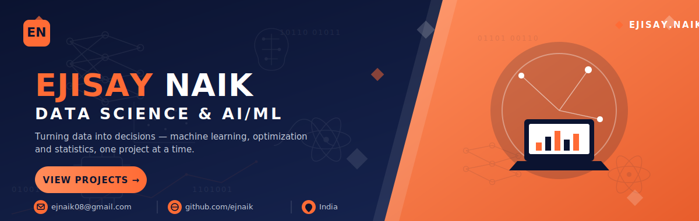

<!-- Custom Navy / Orange Corporate Header Banner -->

 

  
  &nbsp;
  
  &nbsp;
  
  &nbsp;
  

 

## ◆ ABOUT ME

 

  <b> Name:</b> Ejisay Naik &nbsp;|&nbsp; 
  <b> Location:</b> India &nbsp;|&nbsp; 
  <b> Role:</b> Data Science Enthusiast

  <b> Email:</b> <a href="mailto:ejnaik08@gmail.com">ejnaik08@gmail.com</a>

  <b> Currently Learning:</b> RESTfull API, FastAPI, AWS, TensorFlow, Hadoop, Spark, Google AI Studio, DSA  
  <b> Hobbies:</b> Music &nbsp;|&nbsp; Sports &nbsp;|&nbsp; Odia Poem Writing  
  <b> Open To:</b> Collaborating on interesting & impactful projects

 

<i><b>"Thanks for visiting! Let's build something amazing together."</b></i>

  

## &#9670;&nbsp; CURRENTLY FOCUSED ON

## &#9670;&nbsp; TECH STACK

**Languages**
 

  

**Cloud, Backend & Data Engineering**
 

  

**Databases**
 

  

**AI / ML Frameworks**
 

  

**Data Science Libraries**
 

  

**Creative Suite**
 

## &#9670;&nbsp; GITHUB STATS

 

## &#9670;&nbsp; LET'S CONNECT

&nbsp;

&nbsp;

  

> *"Data is the new oil, but insights are the engine."*

 

<!-- Custom Navy / Orange Corporate Footer Banner -->

@July 2026

